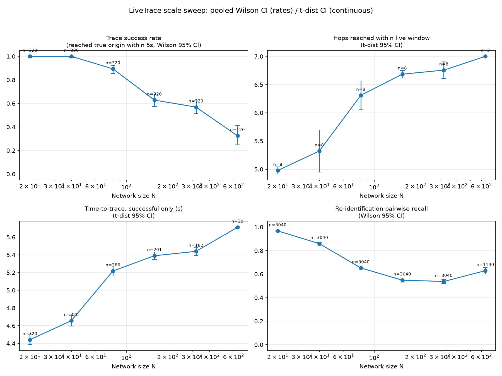
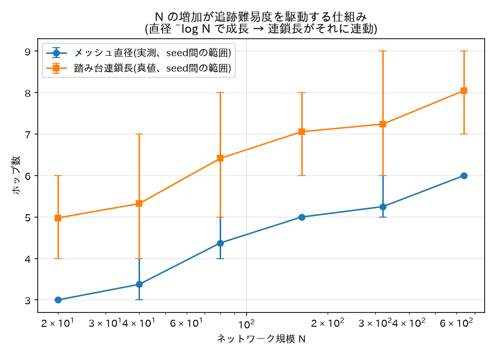

# LiveTrace 実験結果レポート

このドキュメントは LiveTrace(ns-3 上でのオンライン逆探知・再同定シミュレーション)の
パイプライン全体(単ホップ相関 → 多段逆探知 → 再同定 → 規模スイープ)を通した結果を、
図とともに1本にまとめたものである。各フェーズの詳細な経緯・設計判断・実装上の不具合対応は
`docs/summaries/phase0.md`〜`phase6.md` に記録されている。本書はそれらを踏まえた最終結果の提示に徹する。

## 中心的な問い

**生きた5秒間の追跡窓の中で、送信元が毎回変わる断続的攻撃を実時間で再同定しつつ、規模の大きい
ランダムメッシュ網を踏み台連鎖の起点まで遡り切れるか。** 本レポートの主結果は、この問いに対して
ネットワーク規模 N の関数として **統計的に裏付けられた「否」の領域**が実際に観測できたことである。

## 実験環境・設定

- ns-3-dev **3.48**(debugビルド)、WSL Ubuntu 24.04、g++ 13.3、Python 3.12.3、scipy 1.18.0。
- 主結果は `config/scale_sweep.yaml` を使用:
  - トポロジ: Erdős–Rényi、**平均次数固定**(`avg_degree=8`、`p = avg_degree/(n-1)` を導出)。
    固定 p ではなく固定平均次数にすることで、N が増えてもグラフが相対的に疎になり続け、
    メッシュ直径が `~log N` で成長する(詳細は下記「なぜ N が難易度を駆動するか」)。
  - 攻撃者: **2 actor**(単一 actor では再同定の precision が数学的に常に1.0になり無意味な指標になるため)。
    周期は統計的検出力確保のため 420秒→60秒に圧縮(`stop_time_s=1200`、比率は維持)。
  - 踏み台連鎖長: `chain_length_factor=1.2 × 実測直径`(±1ジッター、下限2・上限40)で決定。
    N に依存しない固定連鎖長ではなく、実測直径に連動させている点が本レポートの結果の要。
  - 生きた追跡窓: 5.0秒(蓄積2.0秒 + ホップごと0.6秒)。
- 規模スイープの N グリッド: **20, 40, 80, 160, 320, 640**。N≤320 は8 seed、N=640 は3 seed
  (実測実行時間差に基づく段階運用。N=640 は1 seedあたり約7分)。
  総実行数43、総実行時間3041秒(約51分)、全run正常終了。

## パイプライン構成

| 段階 | 役割 | 実装 |
|------|------|------|
| 単ホップ相関 | Zhang–Paxson型 ON/OFF タイミング相関で、victimへの到達フローから直上流1ホップを確定 | `contrib/livetrace/model/timing-correlator.*` |
| 多段逆探知 | 確定したホップを起点に、生きた5秒窓の中で再帰的に上流へ遡上 | `contrib/livetrace/model/traceback-observer.*` |
| 再同定 | 経路収束+周期性(主)・タイミング相関(本体)・挙動フィンガープリント(補助)で、周期をまたぐバースト群を同一actorへ束ねる | `contrib/livetrace/model/reidentification-engine.*` |
| 規模スイープ | 上記3段をネットワーク規模 N の関数として多シード計測し、平均・信頼区間で評価 | `analysis/evaluate_phase4.py`, `tools/run_sweep_staged.sh` |

いずれの段も、真の攻撃者ID・真の連鎖経路(オラクル)は事後の評価にのみ使用し、
オンラインで動作するシステム自身には一切渡していない。

## 主結果: 規模スイープ



*(`analysis/plot_sweep.py` で `results/sweep_summary.csv` から生成。率指標(追跡成功率・再同定再現率)は
全試行をプールした Wilson 二項95%信頼区間、連続指標(到達段数・time-to-trace)はt分布95%信頼区間。
各点に標本数を併記。)*

**追跡成功率(真の起点への到達率)は N=20〜40 の 1.000 から、N=640 で 0.325 [0.248, 0.413] まで
単調に低下する。** これは「システムが頑健である」ことを示す平坦な結果ではなく、
中心的問いに対する明確な難易度曲線であり、本プロジェクトが最終的に得た主結果である。

## なぜ N が難易度を駆動するか



*(`analysis/plot_mechanism.py` で `results/oracle_*.jsonl` の実測直径・真の連鎖長から生成。
誤差棒は seed 間の範囲(最小〜最大)。)*

平均次数を固定してトポロジを生成しているため、メッシュ直径は N とともに対数的に成長する
(実測平均: N=20 で 3.00 → N=640 で 6.00)。踏み台連鎖長はこの直径に連動して決まるため
(N=20 で平均4.98ホップ → N=640 で平均8.05ホップ)、生きた5秒窓の固定予算
(蓄積2秒+ホップごと0.6秒 ≒ 5〜6ホップ分)を N の増加とともに実質的に超え始める。
これが規模スイープで観測された難易度曲線の直接の要因である。

## 能力別の結果

### 単ホップ相関(Phase 1 相当)
全 N を通じて **単ホップ再現率・適合率ともに 1.000**(Wilson 95%CI の下限も N=640 で 0.969 と
高水準を維持)。真の上流候補と最良のノイズ候補とのスコア差は 1.84〜1.89(t分布95%CI 幅 0.02〜0.03)
と N に依存せず安定しており、Zhang–Paxson型 ON/OFF 相関そのものは規模が増えても破綻していない。

### 多段逆探知(Phase 2 相当)
窓内到達段数は N=20 の 4.98 ホップから N=640 の 7.00 ホップへ、time-to-trace は 4.44秒から
5.71秒へ、いずれも N とともに単調に増加する。**単ホップ相関が全 N で完璧を維持しているにもかかわらず
追跡成功率が低下する**ことから、失敗の原因は相関エンジンの精度劣化ではなく、
**直径連動で伸びた連鎖の全ホップを5秒予算内に遡り切れないこと**(時間予算の枯渇)だと明確に切り分けられる。

### 再同定(Phase 3 相当)
2 actor 構成での**ペアワイズ再同定再現率**は N=20 の 0.967 から N=160〜320 付近で 0.53〜0.55 まで
低下し、N=640 でやや回復(0.629)する非単調な挙動を示した。**適合率**は2 actor 構成のため
自明値ではなく意味のある指標として機能しており、全 N で 0.99 以上を維持している
(再同定が「別 actor のバーストを誤って同一クラスタに入れる」誤りはほぼ起きていない一方、
「同一 actor のバーストを取りこぼして別クラスタに分けてしまう」再現率側の誤りが N とともに増える、
という非対称な失敗パターン)。

## 考察

1. **中心的困難が定量的に観測できた。** 追跡成功率が N=20〜40 の 100% から N=640 の 32.5% まで、
   統計的信頼区間付きで単調に低下する曲線が得られた。これは規模スイープの主目的である
   「5秒窓で規模の大きいメッシュを起点まで遡り切れるか」という問いへの、具体的で反証可能な答えである。
2. **失敗要因の切り分けができた。** 単ホップ相関の精度は N に依存せず高水準を維持する一方、
   到達段数・time-to-trace は N とともに増加する。これにより、規模が難易度を上げる経路は
   「相関アルゴリズムの破綻」ではなく「窓予算と連鎖深さの競合」であることが明確になった。
3. **初期の規模スイープ(Phase 4)で得られた「全 N で成功率100%」は、この結果とは対照的な
   誤った結果だった。** 当時は踏み台連鎖長が N に依存しない固定値であり、かつ固定エッジ確率の
   トポロジでは N が増えてもメッシュ直径がほぼ一定に留まっていたため、規模を上げても
   実質的に何も難しくなっていなかった。Phase 6 の監査でこの実験設計上の欠陥
   (および評価スクリプト側の複数の統計的欠陥)を特定し、本レポートの設定に修正した
   (詳細は `docs/summaries/phase6.md`)。

## 再現方法

```bash
tools/run_sweep_staged.sh config/scale_sweep.yaml results   # 約51分: N<=320は8 seed, N=640は3 seed
python3 analysis/evaluate_phase4.py --results-dir results \
    --n-values 20 40 80 160 320 --seeds 1 2 3 4 5 6 7 8 --out-csv /tmp/sweep_stage1.csv
python3 analysis/evaluate_phase4.py --results-dir results \
    --n-values 640 --seeds 1 2 3 --out-csv /tmp/sweep_stage2.csv
head -1 /tmp/sweep_stage1.csv > results/sweep_summary.csv
tail -n +2 /tmp/sweep_stage1.csv >> results/sweep_summary.csv
tail -n +2 /tmp/sweep_stage2.csv >> results/sweep_summary.csv
python3 analysis/plot_sweep.py --csv results/sweep_summary.csv --out-dir results
python3 analysis/plot_mechanism.py --results-dir results \
    --n-values 20 40 80 160 320 640 --out docs/figures/mechanism_vs_n.png
```

`docs/figures/` 配下の2枚は上記コマンドの出力をコピーしたもの(再現可能なため `results/` 自体は
gitignore 対象だが、このレポートに埋め込む2枚のみ `docs/figures/` にコミットしている)。

## 付録: 数値表(`results/sweep_summary.csv` より)

| N | バースト数 | 追跡成功率 [Wilson 95%CI] | 単ホップ再現率 | 窓内到達段数 (±t分布95%CI) | time-to-trace (±t分布95%CI) | 真偽スコア差 (±t分布95%CI) | 再同定適合率 [Wilson 95%CI] | 再同定再現率 [Wilson 95%CI] |
|---|---|---|---|---|---|---|---|---|
| 20  | 320 | 1.000 [0.988, 1.000] | 1.000 | 4.98 ± 0.06 | 4.44s ± 0.06s | 1.89 ± 0.03 | 1.000 [0.999, 1.000] | 0.967 [0.960, 0.973] |
| 40  | 320 | 1.000 [0.988, 1.000] | 1.000 | 5.32 ± 0.37 | 4.66s ± 0.06s | 1.87 ± 0.03 | 1.000 [0.999, 1.000] | 0.859 [0.846, 0.871] |
| 80  | 320 | 0.894 [0.855, 0.923] | 1.000 | 6.31 ± 0.25 | 5.22s ± 0.06s | 1.87 ± 0.02 | 0.999 [0.996, 1.000] | 0.652 [0.635, 0.669] |
| 160 | 320 | 0.628 [0.574, 0.679] | 1.000 | 6.68 ± 0.07 | 5.39s ± 0.04s | 1.87 ± 0.03 | 0.999 [0.997, 1.000] | 0.548 [0.531, 0.566] |
| 320 | 320 | 0.569 [0.514, 0.622] | 1.000 | 6.76 ± 0.15 | 5.44s ± 0.04s | 1.85 ± 0.03 | 0.993 [0.987, 0.996] | 0.537 [0.519, 0.555] |
| 640 | 120 | 0.325 [0.248, 0.413] | 1.000 | 7.00 ± 0.00 | 5.71s ± 0.00s | 1.84 ± 0.03 | 1.000 [0.995, 1.000] | 0.629 [0.601, 0.657] |

単ホップ再現率・適合率はいずれも Wilson 95%CI の下限が N=640 でも 0.969 以上(表では点推定のみ記載)。
生データは `results/sweep_summary.csv`(各セル320または120試行、詳細な信頼区間・標本数を含む)を参照。
