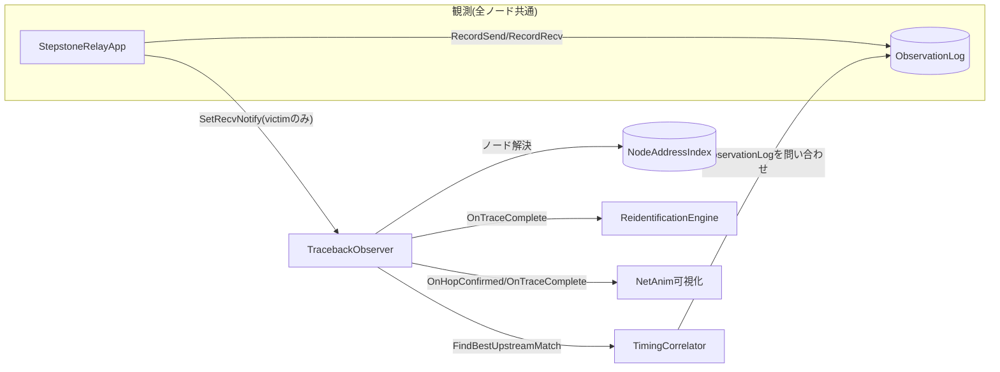
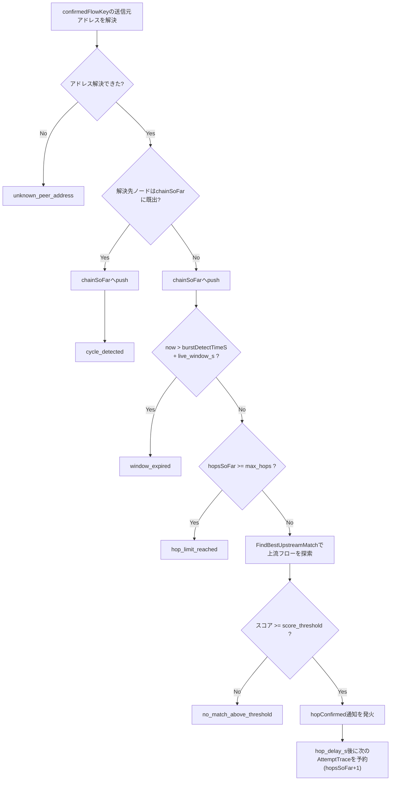

# トレースバックアルゴリズム詳解

## 1. 位置づけとスコープ

本ドキュメントは、LiveTrace の中核である「生きた5秒窓の中での多段ホップバイホップ逆探知」を、
実装 (`contrib/livetrace/model/timing-correlator.*`, `contrib/livetrace/model/traceback-observer.*`)
に即して1箇所に詳解する技術リファレンスである。`docs/summaries/phase1.md`・`phase2.md` がフェーズ導入時の
開発経緯(遭遇した不具合・設計判断の理由)を記すのに対し、本書は**現在のコードが実際に何をしているか**を
正確に記述することに徹する。数値結果は `docs/results.md` を、再同定(`ReidentificationEngine`、バーストを
またいだ同一actor判定)は §9 の概要のみに留め本書のスコープ外とする。

## 2. 全体像



- **`ObservationLog`**: 全ノードの送受信イベント(時刻・ノードID・フローキー・方向・サイズ)を集約する
  中央のログ。相関エンジン・逆探知observer・再同定エンジンが読める**唯一の入力**であり、どのフローが
  真に連鎖しているか/攻撃かという情報は一切持たない(`contrib/livetrace/model/observation-log.h` 冒頭コメント)。
  任意のノードの任意のフローを制約なく問い合わせられる点は「観測の全知性」(README参照)の実体である。
- **`NodeAddressIndex`**: IPアドレス→ノードIDの公開アドレス帳。攻撃の真値とは無関係に、トポロジ構築時の
  インタフェース割当から機械的に作られる(実運用のホスト台帳に相当)。
- **`TimingCorrelator`**: 2つのフローのON/OFFタイミングパターンを比較し、相関スコアを返す。単ホップの
  「このフローとこのフローは同じバーストの継続か」を判定する部品。
- **`TracebackObserver`**: victimへの新規フロー到着をトリガに、`TimingCorrelator`を繰り返し呼び出して
  上流へ多段に遡る。生きた窓・ホップ数上限・巡回検出などの停止条件を管理する。

## 3. 単ホップ相関: `TimingCorrelator`

### 3.1 ON/OFF信号化 (`ComputeOnOffSignal`)

あるフローキーの `[t0, t1]` 区間を `bucket_s`(既定 0.05秒)刻みのビンに区切り、各ビンのパケット数が
`onCountThreshold = max(1, on_threshold_pps × bucket_s)` 以上なら `1`(ON)、未満なら `0`(OFF)とする
2値の時系列を作る。ビン数は `ceil((t1-t0)/bucket_s) + 1`。

### 3.2 相関スコア (`Correlate`)

2つの二値信号 `a`, `b` について:

1. **足切り**: どちらかの信号のON/OFF遷移回数(`CountTransitions`)が `min_on_off_transitions`
   (既定3)未満なら、フラットすぎて信頼できないとして即座に **-1(センチネル)** を返す。
2. **ラグ探索**: `lag ∈ [-max_lag_buckets, +max_lag_buckets]`(既定 ±3バケット=±0.15秒)の範囲で
   `b` を `lag` だけずらしながらピアソン相関係数を計算し、最大値を採用する。中継の転送遅延
   (`StepstoneRelayApp` の `UniformRandomVariable(1ms〜15ms)`)による微小なズレを吸収するための
   探索であり、実際の遅延幅(最大15ms)に対して探索窓(±150ms)は十分に余裕がある。
3. 重なり区間の要素数が2未満、または分散が0(定数信号)の場合はそのラグでのスコアを **-1** とする
   (`PearsonAtLag`)。

### 3.3 上流候補の選定 (`FindBestUpstreamMatch`)

引数: `referenceFlowKey`(基準フロー=直下流で既に確定済みのフロー)、`candidateNodeId`(問い合わせ先
ノード)、`t0, t1`(評価区間)、`scoreThreshold`、`excludeFlowKeys`。

1. `candidateNodeId` で `[t0,t1]` 内に観測された全フローキー(`ObservationLog::FlowsAtNode`)を列挙。
2. `referenceFlowKey` 自身と `excludeFlowKeys` に含まれるものを除外。
3. 残った各候補フローについて、**`candidateNodeId` がその候補フローの受信側(Rx)であること**を
   個々のイベントを見て確認する(送信側でしかない=下流方向のフローは候補から除外)。
4. 条件を満たす候補それぞれについて `ComputeOnOffSignal` → `Correlate(基準信号, 候補信号)` を計算し、
   最高スコアの候補を採用。
5. 採用候補のスコアが `scoreThreshold`(既定0.5)**未満**なら `valid=false` を返す
   (=「上流フローが見つからなかった」という結果そのものが、意味のある出力)。

この時点で重要なのは、**候補集合には背景ノイズや他actorのバーストも同居しうる**ことである。
真の上流フローは、それらすべてに対してタイミングパターンの類似度で勝つ必要がある。

## 4. 多段逆探知: `TracebackObserver`

### 4.1 トリガ (`OnFlowObserved`)

victim(`m_victimNodeId`)に新規フローが到着した時にのみ発火する(`StepstoneRelayApp::SetRecvNotify`
経由、victim以外のノードでの受信は無視)。同一フローキーで2回目以降の到着は無視(`m_seenAtVictim`で
重複排除)。トレースIDを発番し、`accumulation_delay_s`(既定2.0秒)後に最初の `AttemptTrace` を予約する。
`chainSoFar` は `[victimNodeId]` から始まる。

### 4.2 再帰ループ (`AttemptTrace`)

1回の呼び出しで行うチェックは、**この順序**で実行される(順序が結果の `chain` の長さ・停止理由の
組み合わせを決定する):



各ステップの詳細:

1. **アドレス解決**: `confirmedFlowKey`(初回は victim 到着フローそのもの)の送信元アドレスを
   `FlowKeySideAddr` でパースし、`NodeAddressIndex::Lookup` でノードIDに変換する。解決できなければ
   `unknown_peer_address` で停止。
2. **巡回検出**: 解決したノードが `chainSoFar` に既に含まれていれば、そのノードを push した**上で**
   `cycle_detected` で停止する(誤相関でループに入った場合の安全弁。実運用者が「巡回した」という
   事実自体を確認できるよう、push してから停止する設計)。
3. **通常時のpush**: 巡回でなければ、解決ノードを `chainSoFar` に追加する。
4. **窓予算チェック**: `now > burstDetectTimeS + live_window_s` なら `window_expired`。
   この時点で **直前に解決したノードは既に chain に含まれている** — 「アドレスは解決できたが、
   相関を試す前に時間切れになった」ケースであり、chain の末尾は「相関未確認のまま次のホップ候補として
   名前が挙がっただけ」のノードになる。
5. **ホップ数上限**: `hopsSoFar >= max_hops`(既定40、`chain_length_absolute_cap` と同じ安全弁の
   位置づけ)なら `hop_limit_reached`。実運用では生きた窓予算の方が先に尽きるため、通常はこの条件に
   到達しない(`docs/summaries` 参照)。
6. **相関探索**: `FindBestUpstreamMatch(confirmedFlowKey, 解決ノード, burstDetectTimeS, now, score_threshold, {confirmedFlowKey})`
   を実行。評価区間 `[burstDetectTimeS, now]` は**バースト検知時刻からの累積区間**であり、
   固定長のスライディング窓ではない — ホップが進むほど `now` が進むため、後段のホップほど広い区間の
   証拠を使える(その代わり生きた窓の残り予算は減っていく)。
   - スコアが閾値未満: `no_match_above_threshold` で停止。**これが「起点に到達した」場合と
     「単に相関を見失った」場合の両方でありうる**唯一の停止理由であり、両者はオンラインシステム
     自身には区別できない(§6で詳述)。
   - スコアが閾値以上: `matched` として記録し、`hopConfirmed` コールバックを発火(NetAnim可視化・
     再同定エンジンへの通知用の下流フロー情報を含む)。`hop_delay_s`(既定0.6秒)後に、
     一致した上流フローを新たな `confirmedFlowKey` として次の `AttemptTrace` を予約する。

### 4.3 生きた窓予算とホップ数のトレードオフ

k番目のホップ(0始まり)を評価する時刻はおよそ
`burstDetectTimeS + accumulation_delay_s + k × hop_delay_s`
であり、これが `burstDetectTimeS + live_window_s` を超えると `window_expired` で打ち切られる。
既定値(`accumulation_delay_s=2.0`, `hop_delay_s=0.6`, `live_window_s=5.0`)では、
理論上おおよそ `(5.0-2.0)/0.6 ≈ 5` ホップ+初回分で **5〜6ホップ程度**が窓内で確定できる計算になる。
これは恣意的なパラメータであり、実際の相関計算時間ではなく「そのホップの証拠が十分蓄積されるまでの
待ち時間」の代理値として設定されている(`docs/summaries/phase2.md`)。

規模スイープでは、平均次数を固定したトポロジ生成によりメッシュ直径が `~log N` で成長し、
踏み台連鎖長 (`chain_length_factor × 直径`) もそれに連動して伸びる。N=20 で平均直径3・連鎖長約5ホップ
だったものが N=640 では直径6・連鎖長約8ホップまで伸び、上記の「窓内で確定できるホップ数」の上限に
実際に抵触し始める。これが規模スイープで観測される追跡成功率低下の直接の機序である(`docs/results.md`)。

## 5. なぜ相関が成立するのか: 攻撃側の送信パターン

`AttackerCampaign::FireBurst`(`contrib/livetrace/model/attacker-campaign.cc`)は、1バーストを
単一の連続送信ではなく、**5〜8個のサブバースト**(各サブバースト内はパケット間隔10ms)を
**0.15〜0.4秒のアイドルギャップ**で区切って送信する。これにより、`accumulation_delay_s`(2秒)以内に
`min_on_off_transitions`(3)を上回るON/OFF遷移が確実に発生し、相関エンジンが早期に判定材料を
得られるよう設計されている。中継 (`StepstoneRelayApp::DoForward`) は受信したパケットを
1〜15msのランダム遅延後に転送するのみで、このON/OFFの大枠のパターン自体は変えずに下流へ伝播する
— これが Zhang–Paxson 型タイミング相関の前提そのものである。

## 6. 「成功」の定義: システムの停止条件 vs 評価上の成功

**オンラインシステム自身は「成功した」という判定を一切行わない。** `TracebackObserver` は
`chainSoFar` と `stop_reason` を `results/traceback_*.jsonl` に出力するのみで、それが真の起点に
到達した結果なのか、途中で見失った結果なのかを判別する情報を持たない(オラクルに一切アクセスして
いないため)。

「成功」は**評価スクリプトが事後的にオラクルと突き合わせて判定する**概念であり、2種類ある:

### 6.1 単ホップ精度 (`analysis/evaluate_phase1.py`)

各バーストについて、victim直上流(真の連鎖の `chain[-2]`)を正しく当てられたかを見る:

```python
matched = attempt is not None and attempt["stop_reason"] == "matched"
online_hits.append(1 if (matched and resolved_node == expected_upstream) else 0)
```

`stop_reason == "matched"` であり、かつ相関で選ばれたフローの送信元ノードが真の直上流ノードと
一致する場合のみ 1。

### 6.2 多段トレース成功 (`analysis/evaluate_phase2.py`)

そのバーストに対応するトレースの**最終的な chain(victim-first順)** を、真の連鎖
(`true_chain` を反転したもの)と**完全一致**で比較する:

```python
chain = final["chain_so_far"]
success = chain == expected  # 部分一致は不可、全ホップが真の連鎖と一致して初めて成功
```

したがって「成功」と判定されるための必要十分条件は:

1. 真の連鎖上の**全ホップ**(起点までの各中継ノード)で、真の上流フローの相関スコアが、
   同時にそのノードへ届いている他の全候補(背景ノイズ・他actorのバースト含む)を上回り、
   かつ `score_threshold` 以上であること。
2. これが `live_window_s`(5秒)の予算内に完了すること(途中で `window_expired` にならないこと)。
3. 最終的に `no_match_above_threshold` で停止したノードが、**真の起点そのもの**であること
   (起点は元来どのノードからも「攻撃者が送信を開始する」だけの存在で、上流フローが存在しないため
   自然に `no_match_above_threshold` になる — これが「起点に届いた」と「見失った」を区別する
   唯一の手がかりだが、判定はあくまで評価側がオラクルと照合して行う)。

`no_match_above_threshold` 以外の停止理由(`window_expired`, `hop_limit_reached`,
`cycle_detected`, `unknown_peer_address`)は、たとえ途中まで正しい経路を辿れていたとしても
**評価上は失敗**として扱われる(部分点はない)。

## 7. 具体例(構成上の一例)

victim(V) ← relay(R) ← origin(O) という2ホップの連鎖を仮定した場合の `traceback_*.jsonl` の
イメージ(値は説明用):

| hops_so_far | chain_so_far | stop_reason | 説明 |
|---|---|---|---|
| 0 | `[V, R]` | `matched` | Vへの到達フローの送信元アドレスからRを解決し、Rで受信中の候補群からOからの上流フローが最高スコアで一致 |
| 1 | `[V, R, O]` | `no_match_above_threshold` | O宛の上流フローの送信元からOを解決したが、Oは起点なのでOで受信中の候補が(この攻撃連鎖に関する限り)存在せず、スコア以前に候補自体が無いか、あってもノイズのみで閾値未満 |

この例では最終 `chain=[V,R,O]` が真の連鎖 `[O,R,V]` の反転と一致するため、評価上「成功」となる。

## 8. 主要な設定パラメータ

| キー | 既定値 (`config/default.yaml`) | 意味 |
|---|---|---|
| `window.live_window_s` | 5.0 | 1トレースに許された総予算(秒) |
| `traceback.accumulation_delay_s` | 2.0 | 最初の相関試行までの待ち時間(秒) |
| `traceback.hop_delay_s` | 0.6 | 2ホップ目以降、各ホップに追加でかかる時間(秒) |
| `traceback.max_hops` | 40 | ホップ数の安全弁上限(通常は窓予算の方が先に尽きる) |
| `correlation.bucket_s` | 0.05 | ON/OFF信号のビン幅(秒) |
| `correlation.on_threshold_pps` | 1.0 | ビンをONと判定するパケットレート閾値 |
| `correlation.min_on_off_transitions` | 3 | この回数未満の遷移しかない信号はスコア-1で棄却 |
| `correlation.max_lag_buckets` | 3 | ラグ探索範囲(±3バケット=±0.15秒) |
| `correlation.score_threshold` | 0.5 | この値未満のスコアは「上流なし」として扱う |

`config/scale_sweep.yaml`(主結果)もこれらのアルゴリズムパラメータは同一値を用いており、
変化させているのはトポロジ(`avg_degree`)・攻撃者数(`count`)・周期(`period_s`)・
実行時間(`stop_time_s`)のみである。

## 9. 前提・既知の制約

- **観測の全知性**: `FindBestUpstreamMatch` が問い合わせる「候補ノードで観測されたフロー」は
  `ObservationLog` を通じて制約なく取得できる。これは全ノードに監視点を持つ集中型防御者を
  仮定しており、部分的なセンサ配置(監視点が一部ノードのみ)は扱っていない(README「中心的な問い」
  末尾の注記を参照)。
- **フローキーは近道を許さない**: `MakeFlowKey` はローカルに見える `addr:port` の5-tuple 相当のみ
  から構成され、バースト・actor・連鎖の識別子は一切含まない(`contrib/livetrace/model/flow-key-util.h`)。
  相関エンジンは本物のタイミング相関を行う必要があり、フローキーを見るだけでは連鎖を復元できない。
- **踏み台はアプリケーション層のオーバレイ**: `TracebackObserver` が遡るのはL7の中継アプリ間の
  関係であり、その間の物理経路(L3ルーティング)が何ホップの物理リンクをまたぐかとは無関係
  (README「設計判断とその理由」参照。NetAnim可視化ではこの2層を別々の色で描き分けている)。
- **累積窓は固定長のスライディング窓ではない**: §4.2 で述べた通り、各ホップの評価区間は
  `burstDetectTimeS` からの累積であり、ホップが進むほど広がる。これはトレースバック観測ログの
  クエリ量が後段ホップほど増えることを意味し、大Nでの実行時間に影響する
  (`ObservationLog` のクエリ実装については本書のスコープ外、コミット履歴の perf 修正を参照)。

## 10. 逆探知から再同定への橋渡し(概要)

トレースが完了する(`stop_reason` が確定する)たびに `TraceCompleteFn` コールバックが発火し、
`ReidentificationEngine::OnTraceComplete` に `chain`・`hop0FlowKey`・`burstDetectTimeS` が渡される。
再同定エンジンはこれらを使って周期性・経路収束・タイミング相関・挙動フィンガープリントの複合スコアで
既知のクラスタ(=同一actorと推定される過去のバースト群)への割当を判定するが、その詳細アルゴリズムは
本書のスコープ外(`contrib/livetrace/model/reidentification-engine.*` を参照)。

## 11. 主要ファイル一覧

| ファイル | 役割 |
|---|---|
| `contrib/livetrace/model/observation-log.{h,cc}` | 全ノード共通の観測ログ(唯一の入力) |
| `contrib/livetrace/model/node-address-index.{h,cc}` | IPアドレス→ノードIDの公開アドレス帳 |
| `contrib/livetrace/model/timing-correlator.{h,cc}` | ON/OFF相関スコア計算 |
| `contrib/livetrace/model/traceback-observer.{h,cc}` | 多段再帰逆探知の本体 |
| `contrib/livetrace/model/attacker-campaign.cc` | 攻撃側のサブバースト送信パターン生成 |
| `contrib/livetrace/model/stepstone-relay-app.cc` | 中継アプリ(受信→ランダム遅延→転送) |
| `analysis/evaluate_phase1.py` | 単ホップ精度の評価 |
| `analysis/evaluate_phase2.py` | 多段トレース成功率の評価 |
| `contrib/livetrace/test/livetrace-test-suite.cc` | `TracebackObserver`/`TimingCorrelator` の単体テスト |
